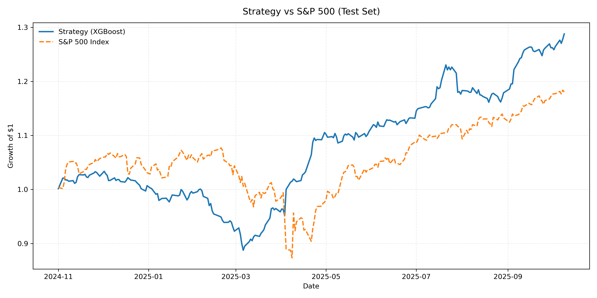
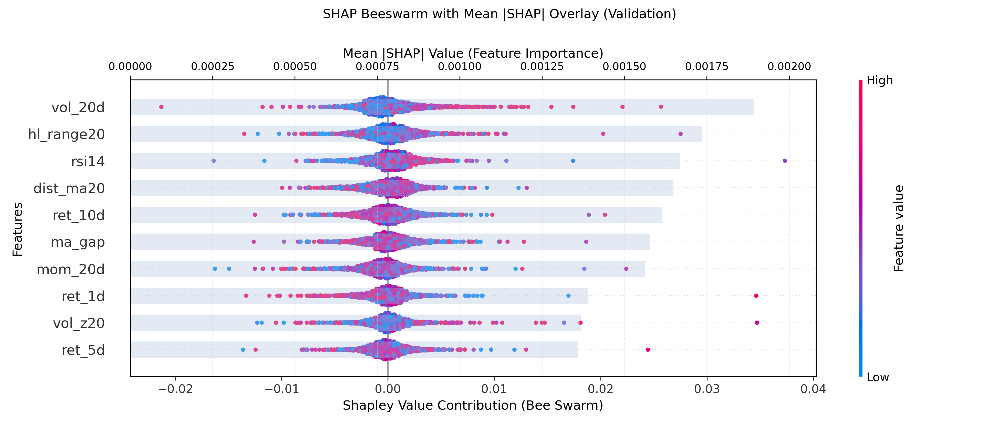

# GP Factor Pipeline (US Equities, Daily)

This project builds an end-to-end research stack for cross-sectional equity alphas.  
It combines **gplearn SymbolicTransformer** (to expand the factor space), **XGBoost** (for modelling + SHAP feature
selection), and a **covariance-aware Markowitz** backtest with benchmark comparison.

The production workflow is in `train_tree_pipeline.py`.  
`run_pipeline.py` remains only as a minimal symbolic-regressor demo and is no longer used for the main experiments.

---

## Workflow Summary

1. **Data & features**
   - Universe: S&P 500 constituents, fetched from Wikipedia.
  - Prices: daily OHLCV via `yfinance` (`data/prices.parquet`).
  - Base features: returns, momentum, volatility, RSI, moving-average spreads, etc.

2. **Symbolic factor expansion**
   - `gplearn.SymbolicTransformer` (15 generations × 2000 population) trained on the **train split only**.
   - Generates 60 symbolic expressions/run → stored in `results/symbolic_feature_map.json`.
   - Base + symbolic features are cross-sectionally z-scored each trading day.

3. **Label preparation**
   - Target: 3-day forward return (`y_fwd`).
   - Transformed to daily cross-sectional percentile ranks (centered at 0) before model fitting.

4. **Model training & SHAP pruning**
   - Model: `xgboost.XGBRegressor` (`tree_method=hist`, `n_estimators=400`, `max_depth=6`,
     `learning_rate=0.05`, `subsample=0.8`, `colsample_bytree=0.5`, `reg_lambda=1.0`).
   - Train + validation split (60/20/20 with embargo fallback) ensures no leakage.
   - SHAP (`TreeExplainer`) on the validation slice; keep Top‑10 features by `mean(|SHAP|)`.
   - Example Top‑10: `rsi14`, `dist_ma20`, `sym_7`, `sym_5`, `sym_1`, `ma_gap`, `sym_30`, `ma10`, `sym_37`, `sym_27`.
   - Final XGBoost model retrained on train+validation, restricted to these 10 factors.

5. **Backtest**
   - `diagnostics.run_markowitz_backtest` (called from `train_tree_pipeline.py` & `diagnostics/run_test_evaluation.py`).
   - Parameters: `top_quantile=bottom_quantile=0.08`, `lookback=63`, `max_abs_weight=0.08`, `gross_leverage=1.0`,
     `min_bucket=20`, `ridge=1e-4`, `cost_bps=1`.
   - Daily rebalancing: quantile baskets → Markowitz weights (with soft caps & transaction costs).
   - Outputs:
     - `results/markowitz_valid_summary.json`
     - `results/markowitz_test_summary.json`
     - Daily series in `results/markowitz_{valid|test}_ts.parquet`

6. **Artefacts**
   - `results/model_summary.json`: IC metrics, selected factors, hyperparameters, annual alpha.
   - `results/top_features.json`: ordered Top‑10 factor list.
   - `results/shap_importance_validation.csv`, `results/shap_importance_test.csv`.
   - Plots copied to `docs/images/` with `python -m diagnostics.render_figures`.

---

## Latest Results (SymbolicTransformer + XGBoost)

**Validation split**
- IC ≈ **0.0081**
- Sharpe ≈ **0.43**
- Annual return ≈ **4.0%**

**Out-of-sample test split**
- IC ≈ **0.0121**
- Annual return ≈ **31.3%**
- Sharpe ≈ **2.24**
- Max drawdown ≈ **-14.1%**
- Information ratio ≈ **0.35**
- Annual alpha vs S&P 500 ≈ **11.8%**

### Test Backtest Equity Curve

<p align="center">
  
</p>

The long/short Markowitz portfolio (blue) grows roughly **31%** annualised with a Sharpe of **2.24**, consistently outperforming the S&P 500 benchmark (orange).  The mild drawdown (~14%) reflects daily rebalancing with soft risk caps.

### Validation SHAP (Top‑10 Features)

<p align="center">
  
</p>

The SHAP beeswarm shows that both classical factors (`rsi14`, `dist_ma20`, `ma10`, `ma_gap`, …) and symbolic features (`sym_7`, `sym_5`, `sym_1`, `sym_30`, `sym_37`, `sym_27`) drive the model.  Positive SHAP contributions lean toward mean-reversion (e.g., high RSI → negative returns), while several symbolic factors act as nonlinear volatility/dispersion gauges discovered during the GP search.

---

## Quick Start

```bash
python -m venv .venv
. .venv/Scripts/activate         # or source .venv/bin/activate
pip install -r requirements.txt
python train_tree_pipeline.py
```

This command executes the entire pipeline: data prep, SymbolicTransformer fitting, XGBoost training, SHAP selection, and Markowitz backtests.  Outputs populate `results/` and plots/figures update under `docs/images/`.

---

## Diagnostics & Utilities

| Purpose                                       | Command |
|----------------------------------------------|---------|
| Re-run Markowitz only (custom params)        | `python -m diagnostics.run_markowitz_backtest --top_quantile 0.08 --bottom_quantile 0.08 --max_abs_weight 0.08 --min_bucket 20` |
| Copy SHAP/test plots to docs (no retraining) | `python -m diagnostics.render_figures` |
| Refresh SHAP + backtests from cached preds   | `python -m diagnostics.run_test_evaluation` |

*The legacy `run_pipeline.py` (single-factor symbolic regression demo) is preserved for reference but not used in this workflow.*

---

## Repository Layout

```
train_tree_pipeline.py        # Main pipeline: SymbolicTransformer + XGBoost + SHAP + Markowitz
run_pipeline.py               # Legacy demo (SymbolicRegressor only)
diagnostics/
  run_markowitz_backtest.py   # Daily Markowitz engine with benchmark comparison
  run_test_evaluation.py      # Copies SHAP + reruns backtests
  render_figures.py           # Copies SHAP plot & regenerates equity curve
data/                         # Cached prices/features (ignored by git)
docs/images/                  # Updated plots (backtest & SHAP)
```

---

Questions, experiments, or improvements? Feel free to adapt the config, add new alpha generators, or open a PR!

---
Happy factor hunting! Feel free to open issues/PRs with improvements or bug reports.
