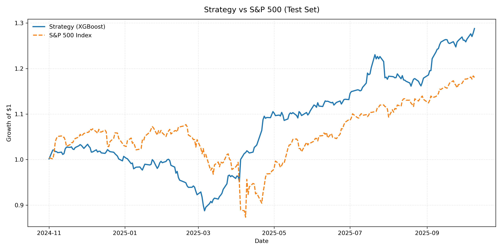
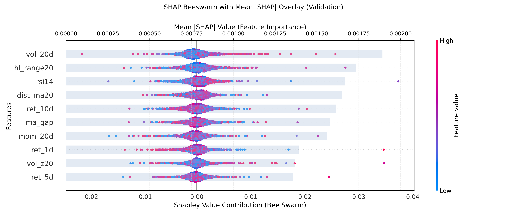

# GP Factor Pipeline (US Equities, Daily)

Hi! This is my project for building a full research pipeline for cross‑sectional equity factors. The idea is to take daily stock data, expand the factor space using genetic programming, and then train a model to build a long/short portfolio. I kept everything in Python and tried to make the workflow easy to run end‑to‑end.

---

## What this project does

**Goal:** find useful equity factors and test them in a realistic backtest.

**Core pieces:**
- **Data**: S&P 500 universe and daily OHLCV prices from `yfinance`.
- **Factor expansion**: `gplearn.SymbolicTransformer` generates new factors from the base ones.
- **Modeling**: XGBoost predicts 3‑day forward returns.
- **Selection**: SHAP picks the top‑10 most important factors.
- **Portfolio**: a covariance‑aware Markowitz backtest builds daily long/short weights.

The main script is `train_tree_pipeline.py`. It runs the full pipeline and stores outputs under `results/` and plots under `docs/images/`.

---

## Pipeline overview (how it flows)

1. **Collect data + build base features**
   - Universe is pulled from Wikipedia (S&P 500 members).
   - Daily prices are stored in `data/prices.parquet`.
   - Features include returns, momentum, volatility, RSI, moving‑average gaps, etc.

2. **Generate symbolic factors**
   - `SymbolicTransformer` runs on the **train split only**.
   - 15 generations × 2000 population, 60 symbolic expressions per run.
   - Outputs are saved to `results/symbolic_feature_map.json`.

3. **Prepare labels**
   - Target = 3‑day forward return.
   - Converted into daily cross‑sectional percentile ranks (centered at 0).

4. **Train model + SHAP pruning**
   - Model: `xgboost.XGBRegressor` (hist tree method).
   - Train/validation/test split = 60/20/20 (with embargo fallback).
   - SHAP on the validation slice → keep top‑10 factors.
   - Final model retrains on train+validation using only these 10 features.

5. **Backtest**
   - Daily rebalancing using quantile baskets + Markowitz optimization.
   - Soft risk caps and transaction costs are included.
   - Outputs are in `results/markowitz_*` and timeseries parquet files.

---

## Latest results (SymbolicTransformer + XGBoost)

**Validation split**
- IC ≈ **0.0081**
- Sharpe ≈ **0.43**
- Annual return ≈ **4.0%**

**Out‑of‑sample test split**
- IC ≈ **0.0121**
- Annual return ≈ **31.3%**
- Sharpe ≈ **2.24**
- Max drawdown ≈ **‑14.1%**
- Information ratio ≈ **0.35**
- Annual alpha vs S&P 500 ≈ **11.8%**

### Test Backtest Equity Curve

<p align="center">
  
</p>

### Validation SHAP (Top‑10 Features)

<p align="center">
  
</p>

---

## Quick start

```bash
python -m venv .venv
. .venv/Scripts/activate         # or source .venv/bin/activate
pip install -r requirements.txt
python train_tree_pipeline.py
```

This runs the entire pipeline: data prep, factor generation, model training, SHAP selection, and the Markowitz backtests.

---

## Useful commands

| Purpose                                       | Command |
|----------------------------------------------|---------|
| Re‑run Markowitz only (custom params)        | `python -m diagnostics.run_markowitz_backtest --top_quantile 0.08 --bottom_quantile 0.08 --max_abs_weight 0.08 --min_bucket 20` |
| Copy SHAP/test plots to docs (no retraining) | `python -m diagnostics.render_figures` |
| Refresh SHAP + backtests from cached preds   | `python -m diagnostics.run_test_evaluation` |

---

## Repository layout

```
train_tree_pipeline.py        # Main pipeline: SymbolicTransformer + XGBoost + SHAP + Markowitz
run_pipeline.py               # Legacy demo (SymbolicRegressor only)
diagnostics/
  run_markowitz_backtest.py   # Daily Markowitz engine with benchmark comparison
  run_test_evaluation.py      # Copies SHAP + reruns backtests
  render_figures.py           # Copies SHAP plot & regenerates equity curve
data/                         # Cached prices/features (ignored by git)
docs/images/                  # Updated plots (backtest & SHAP)
```

---

If you want to experiment, you can tweak hyperparameters in `train_tree_pipeline.py` or add new base features. The project is set up so you can swap components without breaking the full workflow.
