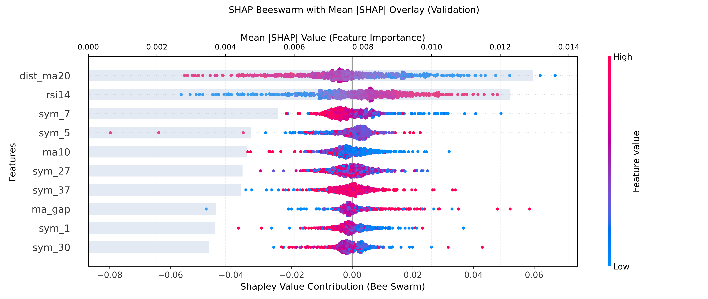

# GP Factor Pipeline (US Equities, Daily)

This repository contains a modular research stack for discovering and validating cross‐sectional equity factors on US stocks. The goal is to combine interpretable symbolic features with modern tree‐based learners, then visualise and evaluate the resulting trading signals.

## High-Level Architecture

1. **Data layer**
   - Universe: S&P 500 constituents sourced from Wikipedia.
   - Market data: daily OHLCV from Yahoo Finance (`yfinance`).
   - Feature cache: stored under `data/` (ignored by git) to avoid recomputation when experimenting.

2. **Feature engineering**
   - Classical technical features (returns, momentum, volatility, RSI, moving-average gaps, etc.).
   - Symbolic expressions generated by `gplearn`’s `SymbolicTransformer` using a custom operator set (`src/model/gp_functions.py`).
   - Optional TSFresh pipeline for rolling window statistics (`src/model/alpha_generators/tsfresh_generator.py`).

3. **Model training (XGBoost focus)**
   - Data split into train / validation / test through `compute_masks` in `src/model/factor_workflow.py`, honouring embargo windows.
   - Symbolic transformer is fit on training samples to produce new factor columns saved to `results/symbolic_transformer/symbolic_all.parquet`.
   - XGBoost is trained on the union of base + symbolic features (`FEATURE_COLS + st_cols`) with configurable hyperparameters in `config.yaml` (`model.params.*`). LightGBM remains a plug‑and‑play alternative via `model.type: lightgbm`.
   - We retain the best features by SHAP importance, applying optional blacklists and a rolling training window (`train_window_days`).

4. **Diagnostics**
   - `python -m diagnostics.signal_diagnostics` produces split‐wise IC/MSE, decile summaries, and monthly IC tables.
   - `python -m diagnostics.advanced_diagnostics` adds feature drift checks, model comparisons (XGB vs Ridge vs LGBM), rolling walk‑forward IC, and monthly top/bottom spreads.
   - `python -m diagnostics.shap_beeswarm_with_importance` regenerates a combined SHAP beeswarm + mean |SHAP| plot for the latest model (figure stored at `docs/images/shap_summary.png`).

5. **Backtesting**
   - `run_markowitz_backtest` (inside `src/model/factor_workflow.py`) builds long/short portfolios using a covariance-aware Markowitz routine with parsimony guards:
     - population shrinkage, market-cap weights, volatility re-scaling, soft caps (`tanh`) and prediction mixing.
     - spread-based exposure control (monthly top/bottom return spread).
   - `python -m diagnostics.run_valtest_evaluation` reuses cached predictions to generate backtests and SHAP artefacts without re-running the full GP search.
   - Default outputs: `results/symbolic_transformer/backtest_timeseries.parquet`, `backtest_cumulative.png`, `backtest_summary.json`.

## Quick Start

```bash
python -m venv .venv
. .venv/Scripts/activate          # Windows (PowerShell): .venv\Scripts\Activate.ps1
pip install -r requirements.txt
python run_pipeline.py
```

The command above performs feature extraction, symbolic search, XGBoost fitting, SHAP diagnostics, and kicks off the Markowitz backtest. Intermediate products land in `results/symbolic_transformer/`.

## Reproducing XGBoost Training

The training flow is orchestrated in `src/model/factor_workflow.py`:

1. **Feature construction**
   ```python
   X, y, groups, meta = build_dataset(cfg)
   st = fit_symbolic_transformer(cfg, X[masks.train], y[masks.train], ...)
   frames, st_all = save_symbolic_outputs(...)
   ```
2. **Training split & windowing** – `apply_train_window` trims train/validation to the most recent `train_window_days` for regime alignment.
3. **Model optimisation**
   ```python
   model, model_type = train_model(cfg, train_df, valid_df, FEATURE_COLS + st_cols)
   shap_importance = compute_shap_importance(model, valid_df, feature_cols, cfg["shap"], ...)
   ```
4. **Feature selection & retrain** – top features are saved to `top_features.json`, blacklists applied, and a final model fit (`retrain_final_model`) on the expanded train+validation window.
5. **Persistence**
   - XGBoost model saved to `results/xgboost_model.json` (LightGBM path supported as well).
   - SHAP importance tables and combined beeswarm figure updated.

## Backtesting Workflow

1. **Standard backtest** – executed as part of `run_pipeline.py` via `run_markowitz_backtest`. The routine:
   - selects long/short buckets by prediction quantiles;
   - clips predicted alphas (`prediction_cap`), optionally mixes them with pure ranking weights, and applies market-cap / volatility scaling;
   - solves Markowitz (pseudo-inverse covariance) with soft/hard constraints, then subtracts transaction costs.
2. **On-demand evaluation** – run `python -m diagnostics.run_valtest_evaluation` for a quick evaluation using cached data; the script outputs fresh SHAP plots and backtest charts without recomputing GP or retraining the symbolic transformer.
3. **Rolling experiments** – enable `rolling.enabled` in `config.yaml` to generate walk-forward backtests and diagnostics automatically (results saved under `results/symbolic_transformer/rolling_quarterly/` when data is sufficient).

## Key Commands

| Purpose                              | Command |
|-------------------------------------|---------|
| Full pipeline run                   | `python run_pipeline.py` |
| Cached evaluation                   | `python -m diagnostics.run_valtest_evaluation` |
| Combined SHAP figure                | `python -m diagnostics.shap_beeswarm_with_importance` |
| Signal diagnostics (IC/deciles)     | `python -m diagnostics.signal_diagnostics` |
| Feature drift & rolling IC          | `python -m diagnostics.advanced_diagnostics` |

## Current Validation Snapshot

<p align="center">
  
</p>

<p align="center">
  
</p>

These artefacts are regenerated whenever `run_valtest_evaluation` or the diagnostics scripts are invoked.

## Configuration Highlights (`config.yaml`)

- **Model block** – switch between `type: xgboost` and `type: lightgbm` with separate parameter dictionaries (`model.params` vs `lightgbm` section). The training utilities automatically pick the matching learner.
- **Symbolic transformer settings** – `symbolic_transformer` section controls population size, generations, mutation probabilities, etc.
- **Portfolio** – `portfolio` block tunes quantiles, transaction costs, market-cap power, soft caps, and spread scaling.
- **Rolling window** – `train_window_days` constrains the recent horizon used for fitting; `feature_blacklist` filters unwanted features from SHAP selection.

## Repository Layout

```
diagnostics/                 # Analysis scripts (IC, SHAP, feature drift, etc.)
docs/images/                 # Figures referenced in README
src/model/factor_workflow.py # Main orchestrator
src/model/backtest_portfolio.py
src/model/gp_functions.py    # Symbolic transformer custom ops
src/model/alpha_generators/  # gplearn / TSFresh adapters
results/symbolic_transformer # Generated factors, SHAP outputs, backtests
```

## Contributing

- Adjust hyperparameters in `config.yaml` or extend the generator interface under `src/model/alpha_generators/` to experiment with new factor families.
- When adding diagnostics, prefer writing standalone scripts under `diagnostics/` so they can reuse cached artefacts (saves time and avoids duplicating the GP search). 
- The repository intentionally excludes large data and binary artefacts via `.gitignore`. Keep commits focused on code and lightweight figures.

---
Happy factor hunting! Open an issue or submit a PR if you extend the pipeline or find a bug.
